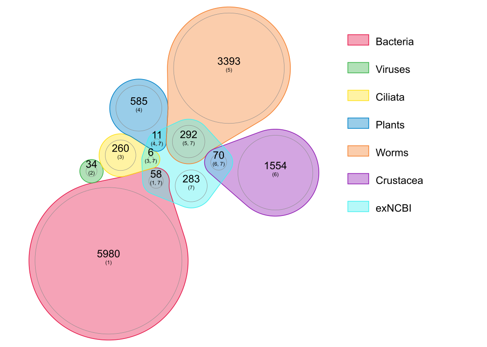
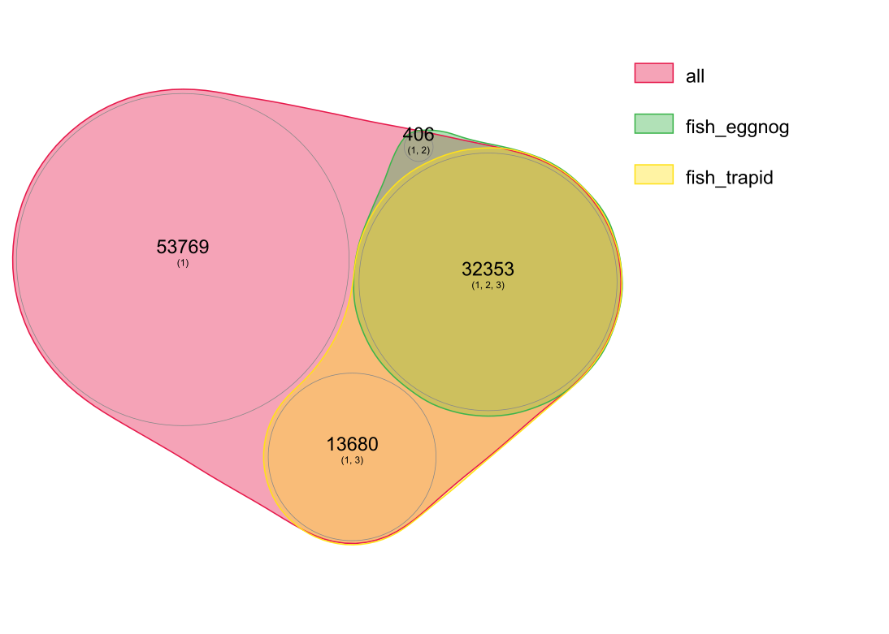

# Paracottus_knerii_transcriptome
Reproducible code for the analysis of a *Paracottus knerii* ("stone sculpin" from Baikal) fry transcriptome.

## Methods

### Raw data

Total RNA was isolated from a dissected *Paracottus knerii* fry (30–60 days old) fixed in RNAlater with a MagMax kit (Thermo Fisher). After quality control (RNA concentration >100 ng/uL, RIN 7.6) 100 ng of RNA was processsed with a TruSeq Stranded mRNA library preparation kit (Illumina), and the library was sequenced with a NovaSeq 6000 device (2 x 101 bp). Q30 value of sequencing: 92.06 %. 
Demultiplexing of the sequencing reads was performed with Illumina bcl2fastq (version 2.20). Adapters were trimmed with Skewer (version 0.2.2) (Jiang et al. 2014). Up to this point, the analysis was performed by the CeGaT company.

Read quality was analyzed with FastQC v0.11.9 (https://github.com/s-andrews/FastQC) and was fairly good to proceed with assembly.

```{bash}
fastqc *
```

The reads were submitted to NCBI: [BioProject PRJNA1200955](https://www.ncbi.nlm.nih.gov/bioproject/PRJNA1200955) and [SRA sample SRR31806589](https://trace.ncbi.nlm.nih.gov/Traces/sra?run=SRR31806589).

### Transcriptome assembly

The main transcriptome assembly used in downstream analyses was performed with rnaSPAdes (Bushmanova et al., 2019, doi:10.1093/gigascience/giz100) v3.13.1 using the `--ss-fr` option. In addition, the Oyster River Protocol ([MacManes, 2018](https://peerj.com/articles/5428/); [readthedocs](https://oyster-river-protocol.readthedocs.io/en/latest/)) was utilized to compare assemblers.
Assembly quality was controlled with BUSCO v5.4.5 (Manni et al., 2021, doi: 10.1002/cpz1.323, [github](https://busco.ezlab.org/)), which uses hmmsearch: 3.3 and metaeuk: 6.a5d39d9, using the Actinopterygii database (`actinopterygii_odb10`).

```{bash}
cd ./02_assembly
rnaspades.py -t 6 -1 ../01_fastq/RNA_S12139Nr1.1.fastq.gz -2 ../01_fastq/RNA_S12139Nr1.2.fastq.gz --ss-rf -o Pkn_rnaspades_ssrf

busco -i ../02_assembly/Pkn_rnaspades_ssfr/transcripts.fasta -l ./actinopterygii_odb10/ -o Pkn_rnaspades_busco -m transcriptome --offline
```

```{bash}
mkdir 07_oyster; sudo chmod 777 07_oyster #otherwise oyster cannot write there; if it uses its own dir, uses up the space
docker run -it --mount type=bind,source=/media/main/sandbox/drozdovapb/S12139,target=/home/orp/docker macmaneslab/orp:2.3.3 bash


$HOME/Oyster_River_Protocol/oyster.mk TPM_FILT=1 STRAND=RF MEM=48 CPU=10 \
READ1=docker/S12139_1/01_fastq/RNA_S12139Nr1.1.fastq.gz READ2=docker/S12139_1/01_fastq/RNA_S12139Nr1.2.fastq.gz \
RUNOUT=Pnk_oyster DIR=docker/S12139_1/07_oyster
# this works fine but freezes at BUSCO, so ran BUSCO the same way for all assemblies:
cd ./03_check
busco -i ../02_assembly/Pnk_oyster.ORP.fasta -l ./actinopterygii_odb10/ -o Pkn_orp_busco -m transcriptome --offline -c 6
# and so on
```

### Annotation

First, is it the right species?

Downloaded `MW732164` (the reference mitochondrial genome sequence for this species).

```
cd ./03_annotation/
exonerate --query Pkn_ref_mt.fa --target ../02_assembly/GLBE01.1.fsa_nt --bestn 10 >>mt_in_Pkn.exonerate.out
```

Yes, it is.

Then, the assembly was filtered in muliple steps in order to only retain the most (relatively) reliable information sources. 

- First, kentUtils [https://github.com/ENCODE-DCC/kentUtils] was used to filter by length (>199 bp) and Ns (<9N):
  `$apps/kentUtils/faFilter -minSize=200 -maxN=8 Pkn_rnaspades_ssrf.fasta ../06_annotation/Pkn_rnaspades_ssrf_filtlength.fasta`
  NCBI actually requires >200 nt and maxN=14 but I needed to be more strict to pass  the TRAPID filters (see below).
- The resulting file passed the TRAPID threshold and was processed with TRAPID [http://bioinformatics.psb.ugent.be/trapid_02/trapid/].
- Protein prediction:
  ```
  $apps/TransDecoder-TransDecoder-v5.7.0/TransDecoder.LongOrfs -t Pkn_rnaspades_ssrf.fasta -m 50 -f 
  $apps/TransDecoder-TransDecoder-v5.7.0/TransDecoder.Predict -t Pkn_rnaspades_ssrf.fasta --single_best_only
  ```
  Then the result was submitted to eggnog-mapper v2.1.12 [http://eggnog-mapper.embl.de].
- FCS in Galaxy [usegalaxy.org] was used to filter out contamination.
- Then, the sequences were filtered so that they contained FCS-GX taxonomy filtered AND (Chordata according to TRAPID OR Chordata according to eggnog-mapper). The lists were prepared with R (see `add_annotation_to_names.R`). Filtering was done with `seqkit`:
  ```
  seqkit grep -f transcripts_for_TSA_submission_names.txt Pkn_rnaspades_ssrf_FCS_GX_cleaned.fasta -o Pkn_rnaspades_ssrf_FCS_GX_cleaned_Chordata.fasta
  ```
- Then, annotation was added to the names with `seqkit` as well (also see `add_annotation_to_names.R`):
  ```
  seqkit replace -p "(.*)" -r '{kv}' --kv-file annotated_transcripts.tsv Pkn_rnaspades_ssrf_FCS_GX_cleaned_Chordata.fasta >Pkn_rnaspades_ssrf_FCS_GX_cleaned_Chordata_annotation.fasta
  ```
- The remaining sequences matching `gnl|uv|NGB04003.1:1-33 Illumina TruSeq UD/CD Adapter Trimming Read 1` were removed from the file
  ```
  echo "NODE_10572_len_2355_cov_20_-_Kelch repeat-containi" >seq2remove.txt
  echo "NODE_10133_len_2412_cov_20_-_Kelch repeat-containi" >> seq2remove.txt
  seqkit grep -n -f seq2remove.txt -v Pkn_rnaspades_ssrf_FCS_GX_cleaned_Chordata_annotation.fasta > Pkn_rnaspades_ssrf_FCS_GX_cleaned2_Chordata_annotation.fasta
  ```

The assembly was submitted to NCBI TSA database under accession [GLBE00000000](https://www.ncbi.nlm.nih.gov/nuccore/GLBE00000000.1).

### Alignment

Search for immune-related genes for primer design was performed with `exonerate` [Slater & Birney, 2005](https://doi.org/10.1186/1471-2105-6-31) v 2.4.0. Exonerate is part of Ensembl [Harrison et al., 2024](https://doi.org/10.1093/nar/gkad1049).


```{bash}
# report human-readable alignments and reports
for file in Paracottus_knerii_transcriptome/04_immune_genes/refs_rainbow_trout/*txt; do exonerate --query $file --target GLBE01.1.fsa_nt  --bestn 3  >$file.alignment.exonerate.txt; done
# blast and report full transcripts
for file in Paracottus_knerii_transcriptome/04_immune_genes/refs_rainbow_trout/*txt; do exonerate --query $file --target GLBE01.1.fsa_nt  --ryo ">%ti %td \n%ts \n" --bestn 3 --showvulgar no --showalignment no -V 0  >$file.transcript.exonerate.fasta; done
mv Paracottus_knerii_transcriptome/04_immune_genes/refs_rainbow_trout/*exonerate* Paracottus_knerii_transcriptome/04_immune_genes/res_by_rainbow_trout/
# blast and report CDSs
mv Paracottus_knerii_transcriptome/04_immune_genes/refs_rainbow_trout/*exonerate* Paracottus_knerii_transcriptome/04_immune_genes/res_by_rainbow_trout/
for file in Paracottus_knerii_transcriptome/04_immune_genes/refs_rainbow_trout/*txt; do exonerate --query $file --ryo ">%ti %td \n%ts \n" --showvulgar no --showalignment no -V 0  --target Paracottus_knerii_transcriptome/03_annotation/Pkn_rnaspades_ssrf.fasta.transdecoder.cds  --bestn 3  >$file.cds.exonerate.fasta; done
mv Paracottus_knerii_transcriptome/04_immune_genes/refs_rainbow_trout/*exonerate* Paracottus_knerii_transcriptome/04_immune_genes/res_by_rainbow_trout/
```

All analyses except indicated otherwise were performed using a small computing cluster (64 Gb RAM, 6 physical cores, 12 virtual cores).

## Results

### Read QC

51M paired reads (10G bases) were obtained. Quality control with FastQC showed good quality (Q>28) and absense of remaining sequence adapters.

Full fastQC report for forwards reads can be found [here](https://html-preview.github.io/?url=https://github.com/drozdovapb/Paracottus_knerii_transcriptome/blob/main/01_raw_reads_QC/RNA_S12139Nr1.1_fastqc.html) and for reverse reads [here](https://html-preview.github.io/?url=https://github.com/drozdovapb/Paracottus_knerii_transcriptome/blob/main/01_raw_reads_QC/RNA_S12139Nr1.2_fastqc.html).

### Assembly QC

#### Gene space completeness

The rnaSPAdes assembly had the following BUSCO score:
```{}
       --------------------------------------------------
        |Results from dataset                             |
        --------------------------------------------------
        |C:80.5%[S:64.2%,D:16.3%],F:5.0%,M:14.5%,n:3640   |
        |2929   Complete BUSCOs (C)                       |
        |2336   Complete and single-copy BUSCOs (S)       |
        |593    Complete and duplicated BUSCOs (D)        |
        |181    Fragmented BUSCOs (F)                     |
        |530    Missing BUSCOs (M)                        |
        |3640   Total BUSCO groups searched               |
        --------------------------------------------------
```
It is not close to the ideally desired 100 % but comparable with other fish transcriptome assemblies (e.g., [Zhou et al., 2020](https://doi.org/10.1038/s41597-020-0361-6) or [Kokkonen et al., 2024](https://doi.org/10.1111/eva.13735)) and is suitable for the planned downstream applications, primer design and as a database for MS-MS proteome analysis.

Can we do better? Tried Oyster River protocol:

```
# Summarized benchmarking in BUSCO notation for file ~/S12139/S12139_1/02_assembly/Pnk_oyster.ORP.fasta

# BUSCO was run in mode: euk_tran
	***** Results: *****
	C:74.2%[S:52.2%,D:22.0%],F:6.7%,M:19.1%,n:3640	   
	2700	Complete BUSCOs (C)			   
	1900	Complete and single-copy BUSCOs (S)	   
	800	Complete and duplicated BUSCOs (D)	   
	243	Fragmented BUSCOs (F)			   
	697	Missing BUSCOs (M)			   
	3640	Total BUSCO groups searched		   
```

It is worse (less complete). Okay, checked individual assemblies within this pipeline:

```
Pnk_oyster.spades55.fasta:                             C:75.5%[S:63.3%,D:12.2%],F:6.3%,M:18.2%,n:3640
Pnk_oyster.spades75.fasta:                             C:67.0%[S:56.9%,D:10.1%],F:9.0%,M:24.0%,n:3640
Pnk_oyster.transabyss.fasta:                           C:77.6%[S:63.9%,D:13.7%],F:5.7%,M:16.7%,n:3640	   
Pnk_oyster.trinity.Trinity.fasta:                      C:79.2%[S:42.6%,D:36.6%],F:4.8%,M:16.0%,n:3640	   
#checked the rnaSPAdes assembly in case I accidentally used another version of BUSCO or whatever:
../02_assembly/Pkn_rnaspades_ssfr/transcripts.fasta:   C:80.5%[S:64.2%,D:16.3%],F:5.0%,M:14.5%,n:3640
```
It seems that the first (rnaSPAdes) assembly was the best, so let's proceed with it.


### Annotation

#### Mandatory contamination checks

NCBI requires checks for contamination with FCS-GX [https://submit.ncbi.nlm.nih.gov/about/tsa/#step1].

Ideally, it is done before submission. Otherwise, NCBI runs it upon submission and returns an error.

It is available as a standalone tool: [https://github.com/ncbi/fcs?tab=readme-ov-file]. However, I couldn't get it to work.
Fortunately, it is available in Galaxy as well, and there's a tutorial [https://training.galaxyproject.org/training-material/topics/sequence-analysis/tutorials/ncbi-fcs/tutorial.html].
The first part (NCBI FCS Adaptor) never worked for my file (even though it worked for the example one from the tutorial and for first 10 sequences from my file, but it failed already on the first 20 sequences). The second part ran perfectly. Upd: adaptor contamination check returned two sequences, so I filtered them out by name.

#### Taxonomic composition

Used TRAPID, a web service located at [http://bioinformatics.psb.ugent.be/trapid_02/]. By the way, it's a great tool!

Retrieved a lot of interesting information. Most importantly for us now, 46,033 transcripts were classified as coming from Chordata, i.e., most probably from our object.

It's a whole world within this fish fry! Bacteria, Archaea, Ciliates, flatworms, viruses _etc_. 

[phylum_trapid](03_annotation/Phylum_composition_TRAPID.png)



Fortunately, about 50 % were identified as Chordata (mostly fish and some clearly mislabeled groups of other Chordata).



#### Functional annotation

`eggnog-mapper` (web service at [http://eggnog-mapper.embl.de/]). Only transfer annotation from Chordata!
32,759 sequences annotated.

#### Annotation and filtering results

Stage               | # sequences|
--------------------|-----------|
rnaSPAdes assembly  | 192,773| 
length & N filtering| 100,208|
FCS-GX cleaned      | 99648  |
Probably Chordata   | 46415  |
Adaptor filtering   | 46413  |

### Gene finding

Housekeeping genes (actin, EF1beta) were very similar to the references from *Oncorhynchus mykiss*. The immune genes are much less similar but something is still found.

All results are in the `04_immune_genes/` folder. The `*alignment.exonerate.txt` files contain full reports, the `*transcript.exonerate.fasta` contain transcript sequences, and `*cds.exonerate.fasta` contain CDSs only.

